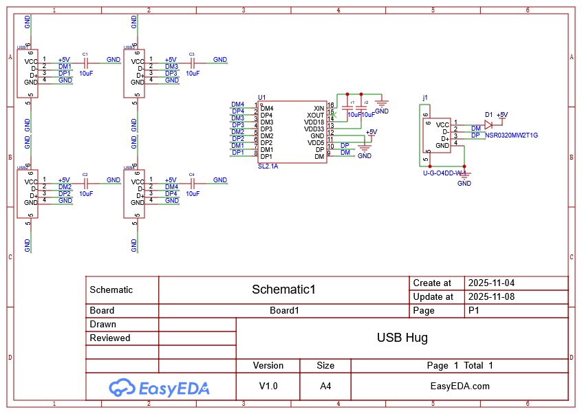
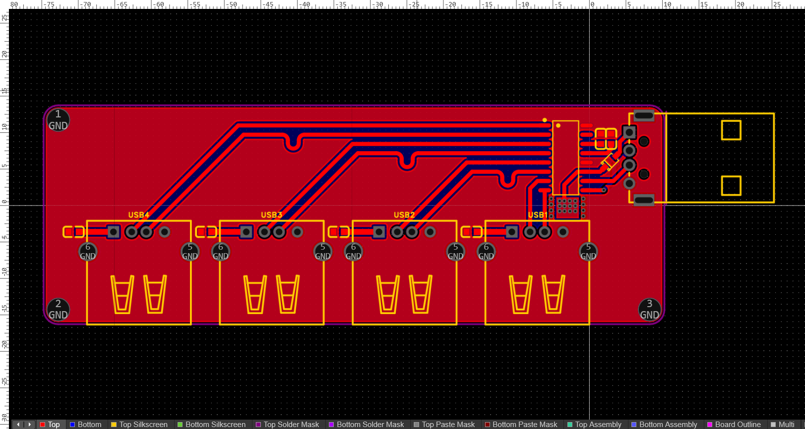
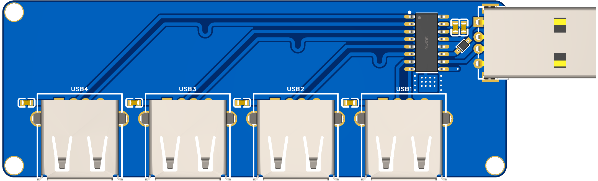

# USB-Hug
*USB Hub. 1 USB port ❌ -> 4 USB ports✅ 

This is a simple USB hub made using CoreChips SL2.1A, which adds 4 USB ports to one USB port.

# Images

## schematic

## PCB

## PCB - 3D

# License
This project is licensed under [MIT License](./LICENSE)

# Contributing
Feel free to contribute the project by creating a pull request.
